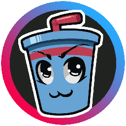

<a id="top"></a>

<h1 name="metrix-home" align="center">
	
    <br>
	Parsec Soda
</h1>

<h3 align="center">
	The open-source Parsec Arcade hosting tool
</h3>

<br>

<h3 align="center">
	:thumbsup: Leave a star and fork this repo if you like this project! :wink:
</h3>

<br>

<a id="summary"></a>
# :clipboard: Summary
 + [Video Demos](#demos)
 + [Social Networks](#social)
 + [What is Parsec Soda?](#about)
 + [What Parsec Soda is not about?](#about-not)
 + [License](#license)
 + [Features](#features)
 + [How to contribute?](#contributing)
 + [Build Instructions](#instructions)
 + [FAQ](#faq)

<br>

<a id="demos"></a>
# :tv: Video Demos
### [Video 1: - Fighting-game gameplay](https://www.youtube.com/watch?v=oIn0dTWHExg)
### [Video 2: - Explanation and Nucleuscoop integration](https://www.youtube.com/watch?v=af_RHzN_oGI)

<br>

<a id="social"></a>
# :mega: Social
### [**Discord Server** - Parsec Soda](https://discord.gg/6RjwckWUhk)
### [**Linktree** - My personal networks](https://linktr.ee/flafdraws)

<br>

<a id="about"></a>
# :video_game: What is Parsec Soda?
Parsec Soda is a custom and open-source [**Parsec**](https://parsec.app/login) tool dedicated to improve Hosting experience in Parsec Arcade.

> I created this tool for my personal use and it has grown too large for me to maintain it by myself, so now I humbly ask this community for help. :joy:

Parsec Soda has a plethora of [**Features**](#features) to assist the Host.

<br>

<a id="about-not"></a>
# :x: What Parsec Soda is not about?
 + Parsec Soda is **NOT** a replacement for the official Parsec client.
 + Parsec Soda can create Arcade rooms, but not join them. So if you want to join a room instead of hosting, you still need the official Parsec client to do it (including your own room created with Parsec Soda) - and I recommend you use the official client for testing your Parsec Soda room.  

<br>

<a id="license"></a>
# :scroll: License
Parsec Soda code is under [MIT license](LICENSE), **BUT** all of the code from [**Parsec SDK**](https://github.com/parsec-cloud/parsec-sdk) has it's own license, the [Parsec SDK License](Dependencies/parsecsdk/LICENSE.md).

Therefore, if you build this source code into a software, you **MUST** abide by their terms, which means you are **NOT ALLOWED TO SHARE** an executable file that uses the Personal API - currently used by this source, more specifically by [**ParsecSession class**](ParsecSoda/ParsecSession.h).

You may only build a copy of your own for personal use (and preferably to also [help me improve](#contributing) this project, haha).  

In order to share executables, one must replace the Personal API in ParsecSession class with the Third-party API, and register the app with Parsec Team. That is part of my future roadmap and, once the app is registered these builds will be available in the Releases tab.

<br>

<a id="features"></a>
# :triangular_flag_on_post: Features
 + Plug/unplug, pre-instance gamepads manually.  
   
 + Manual assignment of gamepad ownership to players via drag-and-drop.  
   
 + Lock/unlock player inputs.  
   
 + Read player inputs in background.  
 + Desktop sharing in Arcade.  
 + Audio control panel with support to Microphone and Speaker channels.  
   
 + Ban/unban players (including the ones who left the room).  
   
 + Edit room name, thumbnail, player slots, privacy, room link in real-time. No need to close and reopen the room.  
   
 + Dedicated chat and log window with support to chatbot commands.  
   
 + Role tiers for chatbot commands. Guests have their own set of commands like "pick a specific gamepad", "drop gamepad" and "play sound effect". And admins can ban/unban guests from chat commands.  
   
 
<br>

<a id="contributing"></a>
# :raising_hand: How to contribute?
 1. Open a new issue reporting what you're going to do (this helps preventing merge conflicts/doubled work).  
 2. Fork this repository.
 3. Create a branch for your feature.
 4. Make your local changes.
 5. Submit a pull request.

You can also check my [Trello board here](https://trello.com/b/ysqWImSD/parsec-soda).

<br>

<a id="instructions"></a>
# :construction_worker: Build Instructions
The building process is not trivial, so I'll guide you through the process and prevent the major caveats.

  1. Download [Visual Studio Community 2019](https://visualstudio.microsoft.com/pt-br/vs/community/).  
  2. Install the C++ development packages.  
  
  3. Pay attention to the checkboxes at the right, you don't need all of them and you can save a lot of disk space by unchecking some of them. I can't tell for sure which ones are expressly required, but most of them are unimportant.
  4. You may need to install the C++/CLI build tools support package from the individual components tab.  
  
  5. When applying the installation, I recommend that you pick the option to download all at once, and then install all at once. It seems faster that way.  
  6. Clone this repository to some folder of your preference. Visual Studio generally uses the path *{user folder}/source/*. You can clone it by download and unzipping from GitHub or by using some version control app (I particularly use [**Fork**](https://git-fork.com/)).
  7. Start Visual Studio 2019 and open the Project Solution.  

  8. Now you must choose one of many paths, depending on the goals of your build. Your options are:  

   + Debug: intended for developers, creates a larger executable but that allows developers to inspect code flow.  
   + Release: intended for final use, creates a lightweight executable stripped from all unnecessary attachments.  
   + x64: For 64-bit Windows users.  
   + x86: For 32-bit Windows users.  

  Below, I list all possible executable directories:  

| Build Goal | Folder |
| :------- | :----- |
| x64 Debug | /x64/Debug |
| x64 Release | /x64/Release |
| x32 Debug | /Debug |
| x32 Release | /Release |

  9. Choose your build options and hit "Build >> Build Solution" (or Ctrl + Shift + B), the folder of your choice will be created and the build **MAY FAIL** at first, but the directory will be created. Even if the build does not fail, when you try to run ParsecSoda.exe it will crash. And that is because you need to copy some dependencies to the executable folder.  

> Please note the first build may take a minute to complete.

  10. Below I list all of the dependencies you need to copy to the build folder to get the app working properly. Copy all of them to the root of your build folder:

| Dependency | File | Source | What is it for? |
| :------- | :----- | :----- | :----- |
| Parsec SDK dll | parsec.dll or parsec32.dll | /Dependencies/parsecsdk/windows/ | Prevents application from crashing, since everything related to Parsec SDK is built upon that dll. Copy parsec.dll if your system is x64. For 32 bits, copy parsec32.dll.
| icons | The icons folder | /ParsecSoda/icons | Without this, ParsecSoda displays no icons, every button and image becomes blank. |
| fonts | The fonts folder | /ParsecSoda/fonts | Without this, all fonts and font sizes will be wrong, degrading user experience. |
| sfx | The sound effects folder | /ParsecSoda/sfx | These are standard sound effects. Without this, the app may crash when a sfx is played (e.g.: when blocking or kicking an user). |

  11. This is how your final build folder should look like:  
  
  
  12. Now, build the project one more time just to be sure (Ctrl + Shift + B) and your executable should be good to go. Enjoy ParsecSoda.

<br>

<a id="summary"></a>
# FAQ
## 1. How do I edit user preferences manually?
In case you want to manually edit user preferences like blocked list, window size and position, room settings, user roles, or even your session cache, all of them are located at the user path: *{user folder}/AppData/Roaming/ParsecSoda*. This is the list of files and what they do:

| File | Handles |
| :------- | :----- |
| banned.json | A list of blocked users. |
| preferences.json | Window size and position, default room details, default audio devices etc. |
| session.json | Your account session cache. **DO NOT SHARE THIS**, it is sensitive data that allows people to login your account directly, even though it is cryptographed. |
| tiers.json | A list of user tiers. |

## 2. How do I create custom sound effects?
If you want to make use of custom sound effects, see the [README file](ParsecSoda/sfx/README.md) in Sound Effects folder.

## 3. The volume of sound effects is too loud!!
Use the Windows sound Mixer to change the volume of Parsec Soda app, that will only affect the SFX (mic and speakers levels will remain unchanged).

## 4. I have audio glitches.
That is because your audio output is at 48khz, so you have 2 options:

### Option 1. Set your audio output to 44.1khz 16-bit.
 1. Go to Windows Sound Outputs.
 2. Choose your output device, go to Properties.
 3. Advanced tab.
 4. Change device frequency to 44.1Khz and bitrate to 16-bit.

### Option 2. Rebuild ParsecSoda to 48khz.
 1. Go to [**AudioOut.cpp**](ParsecSoda/AudioOut.cpp), line 7.  
 2. Replace the frequency levels (44100 -> 48000).
 ```cpp
// Replace this:
#define AUDIO_OUT_DEFAULT_FREQUENCY 44100

// With this:
#define AUDIO_OUT_DEFAULT_FREQUENCY 48000
```
 3. Rebuild the executable.
 5. You may want to do the same for [**AudioInput.cpp**](ParsecSoda/AudioOut.cpp) if you have issues with the microphone.

## 5. I want to lower badwidth usage even if it reduces stream quality.
 1. Go to [**Hosting.cpp**](ParsecSoda/Hosting.cpp), line 367.
 2. Replace FPS value (250 -> 120 or 60):

```cpp
// Replace this:
static const float FPS = 250.0f;

// With this:
static const float FPS = 60.0f;
```
 3. Rebuild the executable.

:warning: The lower the FPS value, the longer the pixelized effect from frame compression will last.

## 6. My window disappeared! I start ParsecSoda and nothing shows up anymore!
*Be not afraid.* 👁👁👁👄👁👁👁

For our convenience, ParsecSoda caches window size and position. BUT. Sometimes (rarely) Windows fails to render the window or some error occurs and ParsecSoda accidentaly saves an invalid window size - like (0, 0) - or an invalid window position - like (32767, 32767).

If that is the case, you can manually edit your preferences at *{user folder}/AppData/Roaming/ParsecSoda/preferences.json*.

These settings should work fine:
```json
{
	"windowX": 0,
	"windowY": 0,
	"windowW": 1280,
	"windowH": 720
}
```

> I've been trying to fix that issue, but it is complicated due to so many possible setups.

<br>

<h3 align="center"><a href="#top">:back:</a></div>